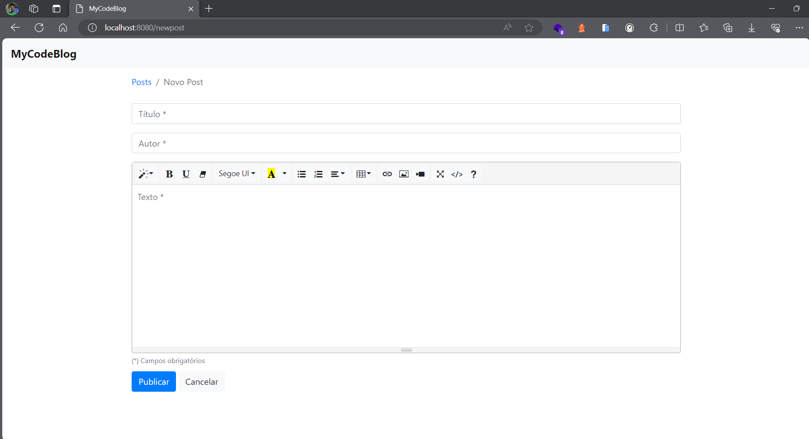

# CodeBlog - Projeto Spring Boot com Thymeleaf, Bootstrap, PostgreSQL e Spring Security

Este é um projeto desenvolvido como resultado do curso "[Criando um blog com Spring Boot e deploy na AWS Elastic Beanstalk](https://www.youtube.com/playlist?list=PL8iIphQOyG-AdKMQWtt1bqdVm8QUnX7_S)" ministrado por [Michelli Brito](https://www.linkedin.com/in/michellibrito/) no YouTube. O projeto utiliza tecnologias como Spring Boot, Thymeleaf, Bootstrap, PostgreSQL e Spring Security para criar um blog funcional.

## Pré-requisitos

- [Java](https://www.oracle.com/java/technologies/javase-downloads.html) (versão 1.8 ou superior)
- [Spring Boot](https://spring.io/projects/spring-boot)
- [PostgreSQL](https://www.postgresql.org/download/) (ou banco de dados de sua escolha)
- [Maven](https://maven.apache.org/download.cgi) (para compilação e empacotamento)
- [IDE](https://spring.io/tools) (recomendado: Spring Tool Suite ou IntelliJ IDEA)

## Configuração do Banco de Dados

O projeto utiliza um banco de dados PostgreSQL. Certifique-se de configurar corretamente as propriedades no arquivo `application.properties`:

```properties
# Configuração para banco local - CodeBlog
spring.datasource.url=jdbc:postgresql://localhost:5432/codeblog
spring.datasource.username=postgres
spring.datasource.password=1234
spring.jpa.hibernate.ddl-auto=update
```

Se você estiver implantando no AWS Elastic Beanstalk, ajuste as configurações conforme necessário.

## Estrutura do Projeto

A estrutura do projeto é organizada da seguinte forma:

- **src/main/java/com/spring/codeblog:** Contém pacotes para configuração, controladores, modelos, repositórios, serviços e utilitários.
- **src/main/resources/templates:** Armazena os modelos Thymeleaf para as páginas HTML.

## Telas da Aplicação




## Executando o Projeto Localmente

1. Clone o repositório.

2. Abra o projeto em sua IDE preferida.

3. Certifique-se de que o banco de dados está configurado corretamente.

4. Execute a aplicação Spring Boot.

5. Acesse a aplicação no navegador usando `http://localhost:8080/posts`.

## Conclusão

Este projeto serve como um exemplo prático do desenvolvimento de um blog usando tecnologias modernas de desenvolvimento web com Spring Boot. Sinta-se à vontade para explorar, modificar e aprender com o código-fonte.

**Divirta-se codificando!** 🚀
